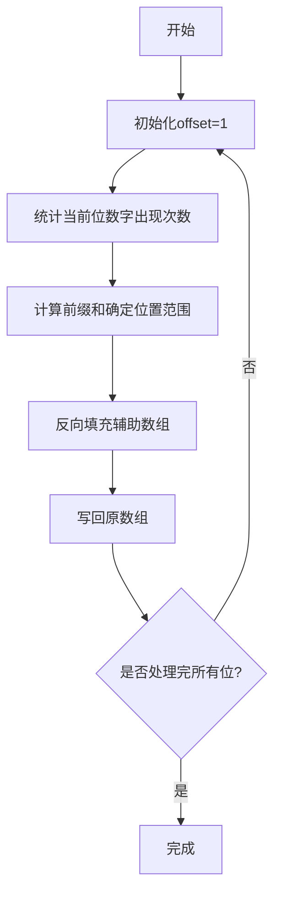

# 基数排序

<font color="#FF0000"> ㄟ(≧◇≦)ㄏ</font>

## 定义
> 一种非比较性的排序算法，通过逐位处理数字的每一位来实现排序  
> 
> 核心思想：**从最低有效位到最高有效位，依次对每一位进行稳定排序** 
> 
> 特点：像整理扑克牌时按花色、数字分堆整理

## 排序步骤

### 1️⃣ 预处理阶段
```csharp
[-3, 5, -9] → 减去最小值(-9) → [6, 14, 0]
```
- **消除负数**：找到最小值，所有元素减去最小值转为非负数
- **确定最大位数**：计算最大值在BASE进制下的位数（决定排序轮数）

### 2️⃣ 按位排序流程


### 3️⃣ 还原数据
```csharp
[6, 14, 0] → 加回最小值(-9) → [-3, 5, -9]
```

## 关键代码解析
```csharp
int digit = (num / offset) % Base;  // 提取当前位的数字
help[--cnts[digit]] = arr[i];       // 反向填充保持稳定性
```

## 复杂度分析 (๑•́ ₃ •̀๑)
| 类型    | 公式          | 说明               |
|-------|-------------|------------------|
| 时间复杂度 | O(k*n)      | k为最大位数，n为元素个数    |
| 空间复杂度 | O(n + BASE) | n为辅助数组，BASE为基数空间 |

## 关键特性
- **稳定性**：通过反向填充保持相同元素的原始顺序
- **负数处理**：通过偏移转为非负数排序后再还原
- **基数选择**：BASE越大排序越快但消耗内存越多（时间与空间trade-off）

## 示例演示
```
原始数组：[-802, 1024, 55, 0]
预处理后：[802-(-802)=0, 1024+802=1826, 55+802=857, 0+802=802]

第一轮（个位）：
统计 → [0:1,6:1,7:1,2:1]
填充 → [0, 1826, 857, 802]

第二轮（十位）：
统计 → [0:1,2:1,5:1,8:1]
填充 → [0, 802, 1826, 857]

第三轮（百位）：
统计 → [8:2, 1:1, 0:1]
填充 → [0, 802, 857, 1826]

第四轮（千位）：
统计 → [0:3, 1:1]
填充 → [0, 802, 857, 1826]

还原结果：[-802, 0, 55, 1024]
```

## 常见问题
❓ **为什么要反向填充？**  
👉 保证稳定性，相同数字的元素能保持原有顺序

❓ **如何选择BASE值？**  
👉 经验值：当n>1e5时选BASE=1024，内存敏感时选BASE=256

❓ **能否处理浮点数？**  
👉 需要特殊处理（如乘以10^精度转为整数）

---